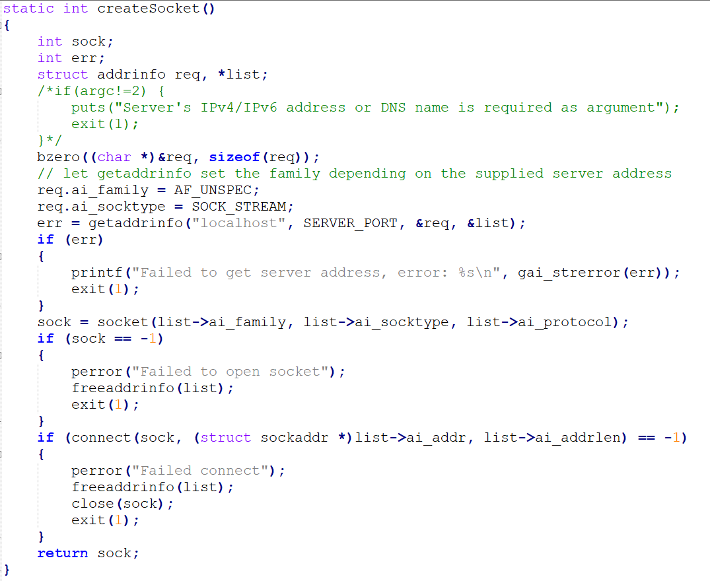
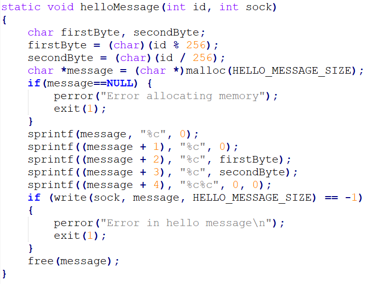
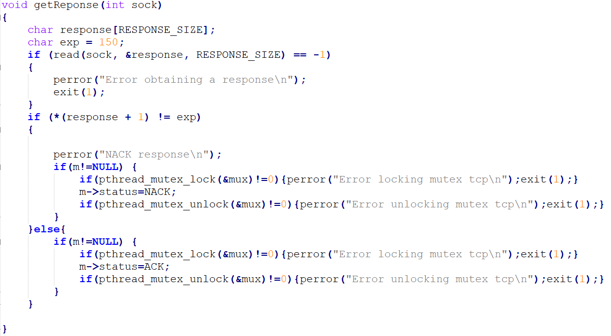
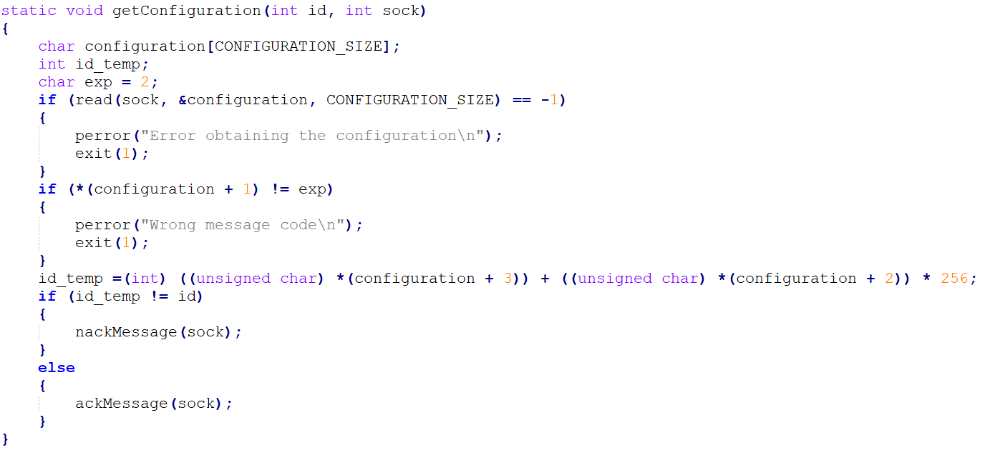
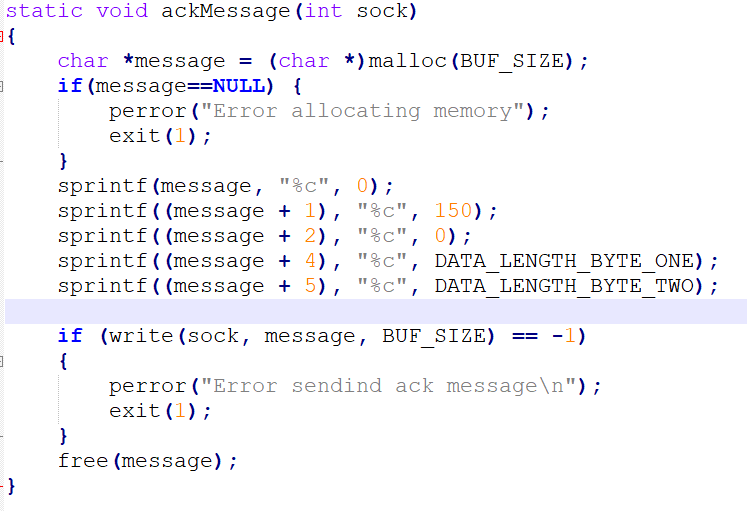
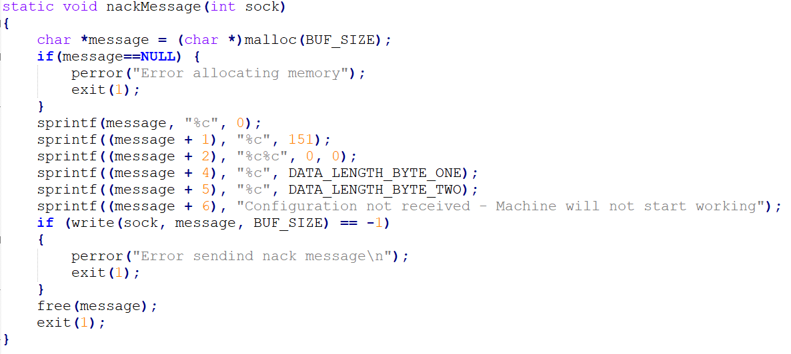
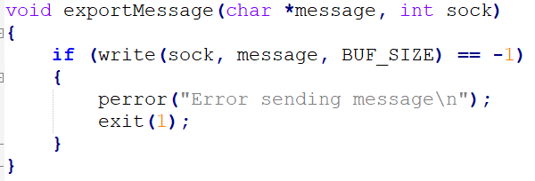
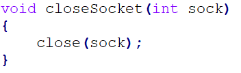

## Client TCP

The machine simulator developed in C will represent only one machine. The team decided to follow this path because for the communication via UDP broadcast must be used as required in the "Communication protocol" file in moodle.  The broadcast is always performed by the same door and so by creating several servers for UDP communication, the same IP would apply which would result in error.

The TCP client consists in a machine validating and sending messages to the central system. It starts by creating the socket which it will use to communicate with the central system.

After that it starts by sending an hello message and receiving an answer that will validate the machine, receiving then the configuration so it can start working and sending an ACK or NACK response whether the configuration is valid or not.

After this, the machine is officially working, it starts by reading files that contain messages creating them and sending through the socket, receiving a response if the message sent e valid or not. 

After reading all the files, the machine  waits for an input to shut down and close the communication via TCP with the server.

