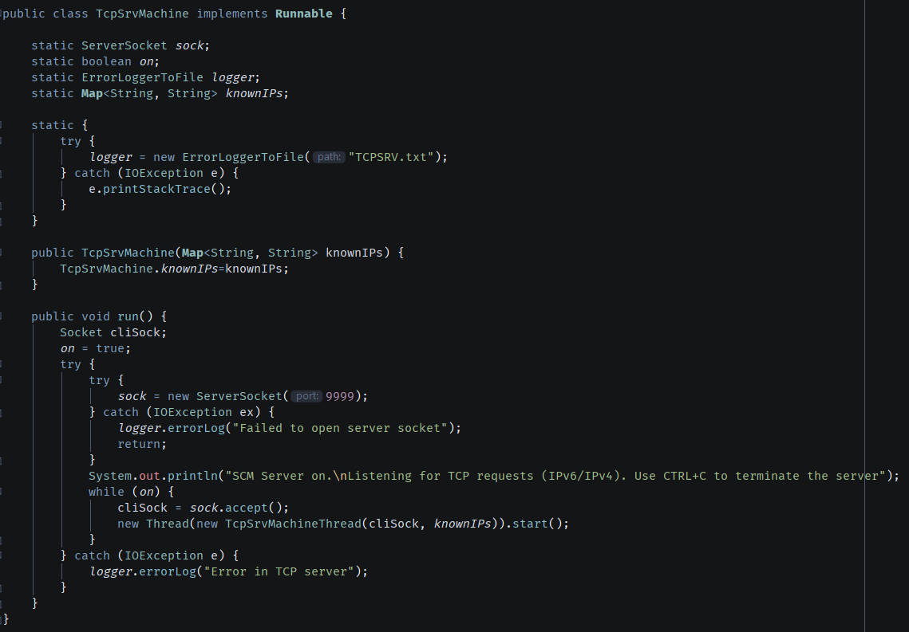
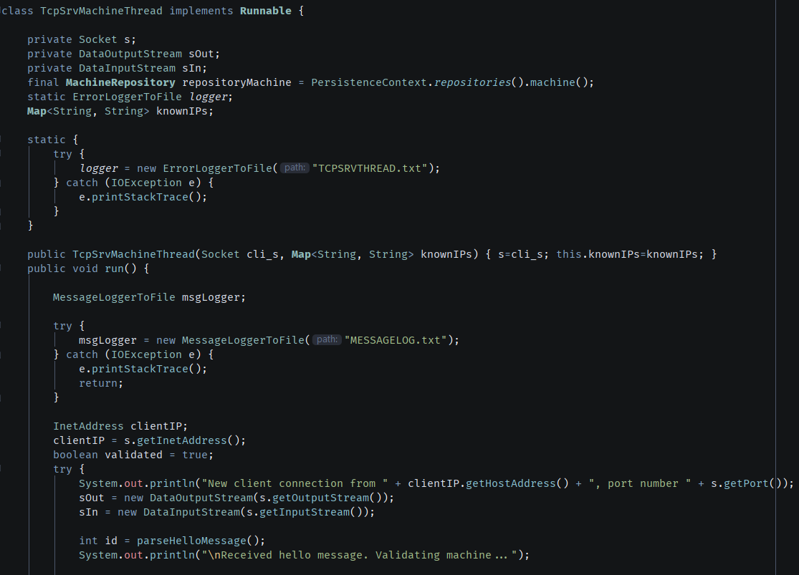
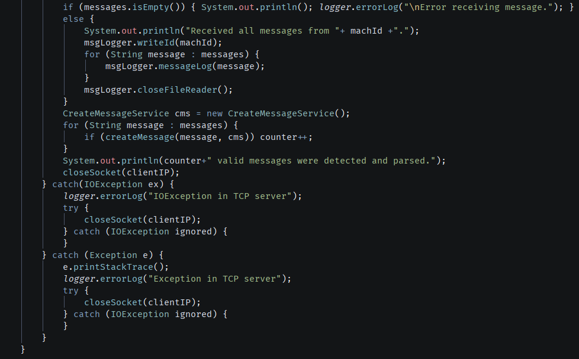
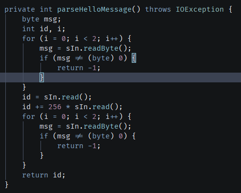
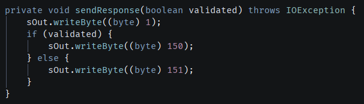
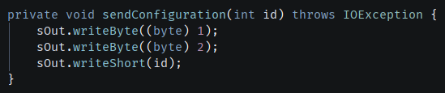
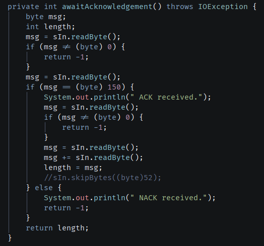
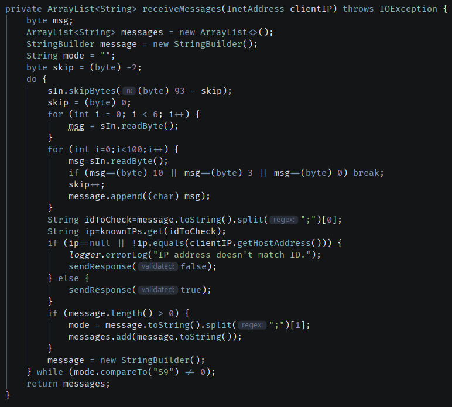
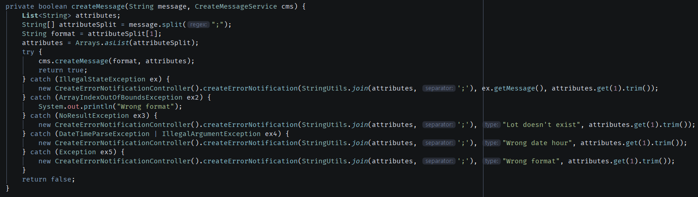
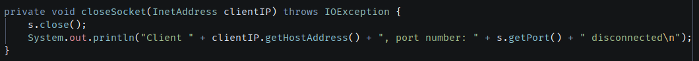

# TCP Server

The TCP server developed in java is responsible for receiving and handling messages from multiple machines concurrently. Every connection is done through port 9999. When started, it waits for connections and, for each one, creates a thread that uses the run() method of TcpSrvMachineThread

## Main TCP Server class

## TCP Server thread class

Each thread starts by waiting for a "hello" message from the machine, which includes the protocol ID of the connected machine.

This ID is used to check if there's a machine with that protocol ID in the database. If there is, an ACK signal response is sent to the machine. If there isn't, a NACK signal is sent, and the socket is closed.

If the machine exists, its configuration is sent to check if its protocol ID matches the one of the connecting machine.

After that, the server registers the machine's internal code and pairs it with the IP address of the connection, for later use. The server waits for a response from the machine.

If an ACK signal is received, then the server tries to read all messages. If a NACK signal is received, then it closes the socket.

After receiving each message, the server will compare the machine's internal code to the IP address the messages are coming from. If they're equal, then it sends an ACK signal to the machine, otherwise it sends a NACK signal. The server continues to receive messages in either case.

After all messages have been received, the server tries to create Message objects using the CreateMessageService class. If a message has an incorrect format or references unexisting objects, it will create an ErrorNotification, detailing the error ocurred.

After creating all messages, the server displays how many were created and closes the socket.

