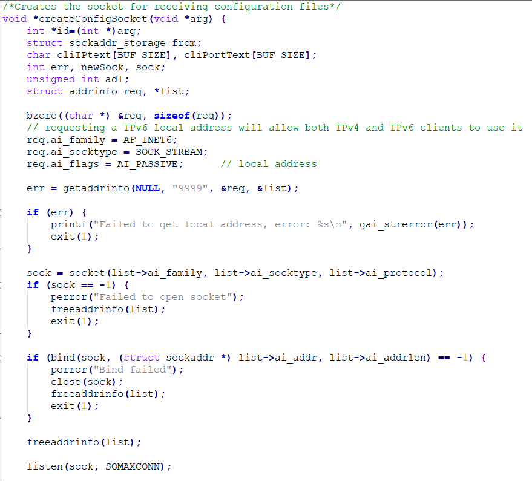

# Client TCP

The TCP client consists in a machine validating and sending messages to the central system. In this sprint, SSL/TLS was used to encrypt the communications between the clients and the server

## Receive configuration files

In this sprint there was a need to send configuration files to the machine from the backoffice. The problem was solved setting up a telnet connection between the backoffice and the SCM and then a TCP connection between the SCM and the machine simulator.

 

Every time a user sent a configuration to a machine the telnet client would communicate with the SCM and it the configuration to be used and machine to sent.

In this stage the SCM would be ready to receive the the configuration and send it to the machine.

The machine on the other side would also be ready to receive configuration files at any time.

Previously the machine when started would have already built the socket used to start communications with SCM and is just waiting to receive the configurations. In this case the machine is the server while the SCM is the client.

The machine will then receive the configuration messages from the SCM and will validate their code and check if the id sent is the same as the machine. If all is correct the machine will then send and ACK message to the server and save the configuration in a local file. If not, an NACK message will be sent.

## SSL/TLS integration

To protect communications between the machines and the SCM pre-shared public key certificates were used.

In the case of receiving config files where the machine is the server, it will start by verifying if the certificates are trusted, restricting then the TLS version and sypher suit and then will create the socket and a new SSL and bind them, so that the SSL can be used to communicate with the SCM.

For the client side of the machine(sending messages), something similar was made. Once again the TLS version and cypher suit will be restricted but in this case it the machine that will set its certificate so that the SCM server may approve it. After that it will try to create an new SSL and bind it with the sock and if the server approves the certificate and connection through SSL will be established.

 

For both the client and server side the communication is made with the functions SSL_write and SSL_read using the SSL created, meaning that both parts are securely communicating.

In the end both the socket and the SSL are closed.

