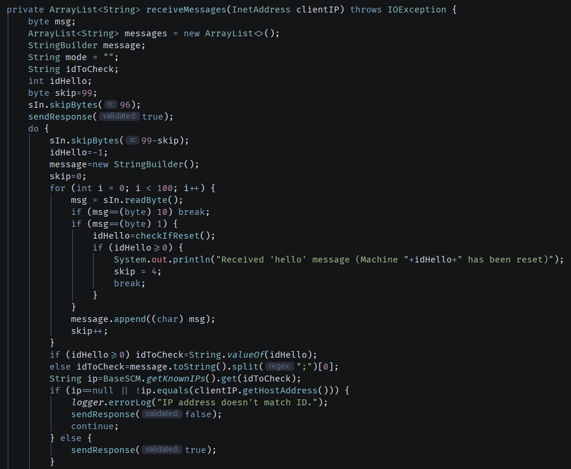

# TCP Server

The TCP server developed in java is responsible for receiving and handling messages from multiple machines concurrently. Every connection is done through port 9999. When started, it waits for connections and, for each one, creates a thread that uses the run() method of TcpSrvMachineThread.

During this Sprint, SSL/TLS was used to encrypt all communications between server and machines.

## SSL/TLS integration

Secure communications were achieved using pre-shared public key certificates. This way, the server can only accept connections from entities with certificates present in its keystore, certificates that, in theory, only factory floor machines use. If the connecting entity gives a certificate not present in the server's keystore (or even no certificate at all) the server won't accept any attempt of communication from that entity and will disconnect.

## New method to receive messages

Since one of the Use Cases requires the server to accept 'Reset' messages in the middle of receiving messages from the machines, the old method was teaked in order to see if the packet received is a machine action message or a 'hello' message, the latter of which means the machine has been reset and will continue to send messages. When a 'hello' message is received, the server still compares the machine ID from that message with the IP it's coming from, and sends a response message (ACK or NACK) if the ID and IP match or not. Other than that, the method is pratically the same.

## Send configuration to Machines

When the SCM app is activated, along with the TCP server, a TelNet server will be activated. This server waits for a connection coming from the backoffice app.

Once accepted, the user using backoffice will select a machine and one of its configuration files to send. The server then receives a message containing the machine's ID and an array of bytes (the configuration file). The server checks if the machine has an associated IP: if it doesn't, it will simply say that the machine doesn't have an associated IP and close the connection. If it does, it attemps to open a TCP connection to the machine's server, which is also protected.

Once it does, the SCM 'client' will send a message containing the machine's ID and the size of the configuration file. After receiving acknowledgement it will send the configuration file.
